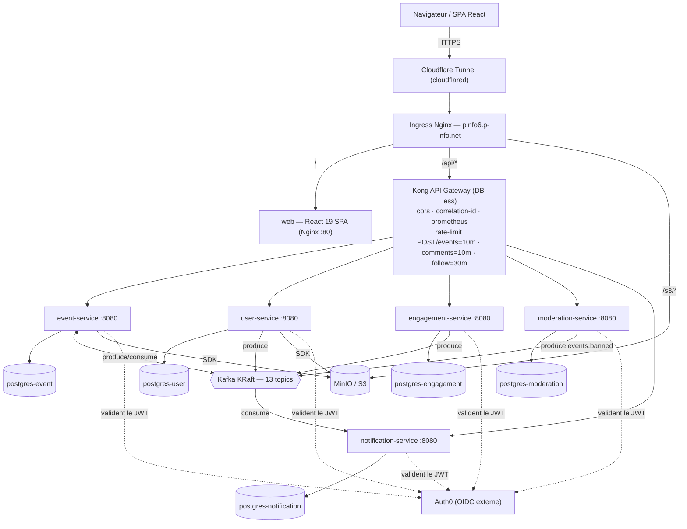
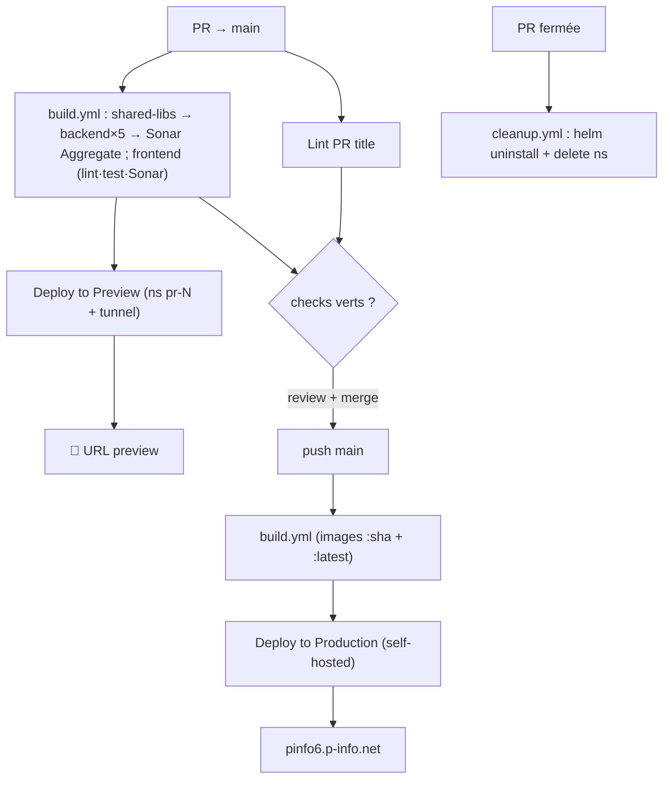

# UNIGE Events — Dossier de présentation finale (master documentation)

> **But de ce fichier.** Document unique, exhaustif et auto-suffisant servant de source de
> vérité pour générer le deck PowerPoint de la **présentation finale** du projet (cours PINFO,
> Groupe 6, UNIGE), devant le professeur (S. P. Hostettler) et les autres équipes.
> Il est organisé autour des points exigés par le prof + le load testing. Chaque section est
> écrite pour pouvoir être transformée en 1-3 slides.
>
> **Production live :** https://pinfo6.p-info.net · **Repo :** `unige-pinfo6-2026/unige-events`
> **DeepWiki :** https://deepwiki.com/unige-pinfo6-2026/unige-events
> **Date du dossier :** 2026-05-30 · **Branche :** `perf/k6-load-testing-v2`

---

## 0. Cadre de la présentation (rappel du brief prof)

Le prof demande une présentation finale (**~15 min**, puis **2-5 min de discussion par personne**)
couvrant :

1. **Team Presentation**
2. **Project Plan**
3. **Architecture**
4. **Domain Object Model**
5. **CI/CD pipelines**
6. **Test Coverage / Sonar Analysis**
7. **Live Demo**
8. **Lesson Learnt – Biggest Challenge – What would we do differently**
9. *(ajout équipe)* **Load Testing** (campagne k6 de capacité production)

Chaque personne explique **sur un exemple concret** ce qu'elle a fait et les challenges/leçons
(« je suis dev backend, j'ai fait ce service, il est structuré comme cela… »).

> ⚠️ **Note d'authorship.** L'équipe a 2 développeurs backend → la présentation détaillera **2
> services en profondeur**. Recommandation de ce dossier : **event-service** (le cœur de domaine)
> + **moderation-service** (le pattern d'architecture le plus distinctif). **engagement-service**
> est documenté comme alternative solide (§6 bis) si la répartition réelle du travail s'y prête mieux.

---

## 1. Team Presentation

**Groupe 6 — UNIGE, cours PINFO 2026.** 5 membres :

| Membre | GitHub | Rôle (d'après l'historique git & la nature des contributions) |
|---|---|---|
| **Agon Kolgeci** | `agonkolgeci` | Backend + **DevOps/Infra** (initial commit, migration microservices, Helm/K8s, Kong, CI/CD) — ~615 commits |
| **Elie Bussod** | `nexiumito` | **Backend** (notifications, engagement, moderation, profils, recurrence…) + load testing — ~630 commits |
| **Daniel Dosh** | `DanyDosh` | Contributeur (~220 commits) |
| **Viona Cufo** | `vionacufo` | Contributeur (~70 commits) |
| **Antoine Maendly** | `antoinemdly` | Contributeur (~55 commits) |

> Les comptes de commits ci-dessus agrègent les multiples identités git (ex. Elie : `Elie Bussod` +
> `Elie Bsd`). À ajuster selon la répartition réelle que l'équipe veut présenter. Le repo ajoute aussi
> **Dependabot** (~79 PRs de mises à jour) et un peu d'assistance **Claude** (~28 commits) comme outils.

**Pitch produit (1 phrase) :** *UNIGE Events est une plateforme centralisée d'événements pour la
communauté universitaire genevoise — découvrir, créer, gérer et participer à des événements
(conférences, sport, culture, social, académique), avec inscriptions, liste d'attente, commentaires,
système de suivi (follow), notifications et modération.*

---

## 2. Project Plan

### 2.1 Méthodologie & organisation
- **Scrum** (Jira, tickets `SCRUM-XXX`), sprints successifs (le repo trace au moins jusqu'au **Sprint 10**).
- **1 PR par tâche**, **review obligatoire** avant merge sur `main`, **titre de PR validé par CI**
  (Conventional Commits + scope Jira pour `feat`/`refactor`/`perf`).
- **Dev Containers obligatoires** (environnement reproductible : Java 21, Node 24, Docker, Kong, DBs
  pré-configurés) — cf. README.
- **Monorepo** : un seul dépôt versionne frontend + backend + contrat API + infra (Helm) + load-tests.

### 2.2 Chronologie
- **Début :** 2026-03-02 (initial commit). **État du dossier :** 2026-05-30. → **~3 mois** de développement.
- **Examen / présentation finale :** **05 juin 2026, 13h-17h30** (date qui remplace la date officielle).
- Grandes étapes visibles dans l'historique :
  - **Monolithe → microservices** : consolidation **14 → 5 services** (PR #158, merge 2026-05-13,
    commit `f4b5968e`), passage **DB-per-service**.
  - **Sprint 8** : finalisation migration (audits multi-agents, 56 findings adressés).
  - **Sprint 9** : notifications event-driven (SCRUM-99/140/145), likes & report de commentaires
    (SCRUM-144), pièces jointes (SCRUM-148), usernames de profil (SCRUM-169), filtre `followedOnly`.
  - **Sprint 10 / finition** : redesign profil + système de follow + calendrier (SCRUM-141), pages
    support/règles, badge Staff (SCRUM-214), **load testing** (campagnes v1 puis v2).

### 2.3 Le projet en chiffres (signaux de volume — pour un slide « scale »)
| Métrique | Valeur |
|---|---|
| Commits | **~1 250** |
| Pull Requests mergées | **~142** (dernière : #221) |
| Tickets SCRUM référencés dans les commits | **41** (Jira en contient davantage) |
| Microservices backend actifs | **5** |
| Shared libs backend | **10** |
| Modules Maven (reactor leaf) | **15** |
| Bases PostgreSQL dédiées | **5** (DB-per-service) |
| Topics Kafka | **13** provisionnés |
| Migrations Flyway (total) | **~29** (event 14 · user 5 · engagement 4 · moderation 4 · notification 2) |
| Endpoints OpenAPI (paths) | **58** |
| Fichiers source backend (`src/main`, Java) | **~206** |
| Fichiers de test backend | **~238** (~2 276 méthodes `@Test`) |
| Fichiers source frontend (`.ts/.tsx`, hors tests) | **~206** |
| Fichiers de test frontend | **167** (~2 173 cas Vitest) |

### 2.4 Périmètre fonctionnel livré
Découverte/recherche/filtre d'événements · création/édition (avec **récurrence**, brouillons,
co-organisateurs, pièces jointes) · cycle de vie (DRAFT→PUBLISHED→CANCELLED/EXPIRED/BANNED) ·
**inscription + liste d'attente** · favoris · vues (anonymes incluses) · **commentaires** (réponses,
likes, @mentions) · **follow** (public auto / privé sur demande) · **notifications** in-app
event-driven · **modération** (signalements + bannissement) · profils publics avec **username** ·
**flux calendrier ICS** · feed chronologique · upload d'images (avatar/bannière/événement) ·
back-office **admin** (modération + mise en avant).

---

## 3. Architecture

### 3.1 Vue d'ensemble
Monorepo : **un frontend React** (SPA) + **un backend Quarkus multi-module** partageant **un contrat
API unique** (`openapi/openapi.yaml`, source de vérité, jamais dupliqué). Le backend est passé d'un
**monolithe** à une architecture **distribuée de 5 microservices**, chacun propriétaire de son domaine
**et de sa propre base PostgreSQL** (database-per-service).

Pattern transverse signature : **« Asynchronous Post-Commit »** — les services émettent leurs
événements de domaine vers Kafka **uniquement après le commit JDBC réussi**, via CDI
`@Observes(during = AFTER_SUCCESS)`. Conséquence : un rollback n'émet jamais d'événement fantôme.

### 3.2 Les 5 microservices
Tous : Quarkus 3 / Java 21 / Hibernate Panache / PostgreSQL dédié / OIDC (Auth0) / Micrometer-Prometheus
/ Flyway. Lecture cross-service via **REST clients MicroProfile** ; écriture cross-service via **Kafka**.

| Service | Responsabilité | Endpoints possédés (groupes) |
|---|---|---|
| **event-service** | Cœur du domaine Event : cycle de vie, récurrence, co-organisateurs, favoris, vues, pièces jointes (S3), share codes, mise en avant, recherche. Seul écrivain de `Event.status` (applique aussi les bans reçus via Kafka). | `/events*`, `/events/search`, `/events/featured`, `/admin/events/{id}/(un)feature`, `/events/{id}/image`, `/events/{id}/share`, `/s/{code}`, `/events/{id}/view`, `/events/{id}/favorite`, `/users/me/favorites`, `/events/{id}/co-organizers/*`, `/users/me/co-organizer-invitations`, `/events/{id}/stats`, `/users/me/events`, `/events/{id}/attachments/*` |
| **user-service** | Identité/profil (sync Auth0), graphe social **follow** (public auto / privé sur demande), username, avatar/bannière S3, **flux ICS** calendrier. Pur **producteur** Kafka. | `/users/me`, `/users/{id}`, `/users/by-username/{u}`, `/users/search`, `/users/me/(image\|banner\|username)`, `/users/{id}/follow*`, `/follow-requests/*`, `/users/me/calendar-token*`, `/calendar/{token}.ics` |
| **engagement-service** | Interactions sur un événement : **inscription (capacity gating + liste d'attente)**, **commentaires** (réponses 1 niveau, @mentions), **likes**. | `/events/{id}/attend*`, `/users/me/attendances`, `/users/me/participations`, `/events/{id}/comments`, `/comments/{id}`, `/comments/{id}/like` |
| **moderation-service** | **Signalements** (événements + commentaires), file de revue admin, **décision de bannissement** (via **outbox transactionnel**), auto-cleanup par seuil. | `/events/{id}/report`, `/comments/{id}/report`, `/admin/reports*` |
| **notification-service** | Hub **event-driven** : consomme les événements Kafka et **fan-out** en notifications in-app ; API de lecture/mark-read. | `/users/me/notifications`, `/users/me/notifications/{id}/read`, `/users/me/notifications/read-all` |

> En cluster, les 5 services écoutent tous le port **8080** ; en dev local (Kong `docker/kong.yml`),
> ils tournent sur **8081-8084** (event 8082, user 8081, engagement 8083, moderation 8084).

### 3.3 Database-per-service (et **pourquoi**)
Chaque service a **sa** base : `postgres-event` (`unige_events_events`), `postgres-user`
(`unige_events_users`), `postgres-engagement` (`unige_events_engagement`), `postgres-moderation`
(`unige_events_moderation`), `postgres-notification` (`unige_events_notifications`).

**Pourquoi (l'histoire à raconter) :** quand les services partageaient une seule base, **chaque
service exécutait ses propres migrations Flyway** qui **entraient en collision dans l'unique table
`flyway_schema_history`** → Flyway échouait aux démarrages successifs (lignes de migration des autres
services vues comme inconnues/hors-ordre). La bascule DB-per-service (commit **`f4b5968e`**, post-PR
**#158**) a réglé ça et a au passage **activé notification-service** (`replicas: 0` → `1`). Pas de FK
cross-base : les références inter-services se font **par UUID / id**, cohérence au niveau applicatif.

### 3.4 API Gateway — Kong (DB-less, déclaratif)
- Kong **3.7**, **sans base** (config déclarative en ConfigMap k8s / fichier en dev). Route `/api/*` →
  `<svc>-service:8080` par **regex path + méthode**. Kong **ne valide pas** le JWT : il transmet le
  `Authorization: Bearer …`, chaque service le revalide via `quarkus-oidc`.
- **Plugins globaux :** `cors` (origines `pinfo6.p-info.net`, `*.trycloudflare.com`), `correlation-id`
  (`X-Request-ID`), `prometheus`, `request-transformer` (strip d'un éventuel `X-Internal-Token` forgé).
- **Rate-limiting (policy `local`)** par route :
  - `POST /api/events` → **10/min** (CREATE uniquement) ;
  - `POST /api/events/{id}/comments` → **10/min** ;
  - `…/users/{id}/follow` → **30/min**.
  - **`GET /api/events` n'est PAS limité** — corrigé en réponse au load testing (cf. §10) : avant, une
    route « toutes méthodes » bridait le listing public à 10/min/IP (inutilisable derrière NAT partagé).

### 3.5 Asynchrone / event-driven — Kafka
- Broker **Kafka KRaft** (sans ZooKeeper), single-broker, **13 topics** (rétention 7 j).
- **Producteurs :** event-service (`events.published/cancelled/expired/updated`, `co-organizers.invited/accepted`),
  user-service (`users.followed/follow-requested/follow-accepted`), engagement-service
  (`comments.created`, `comments.mentions`, `attendances.created`), moderation-service (`events.banned`).
- **Consommateurs :** notification-service (8 consumers : event cancelled/updated, attendance created,
  3× follow, comment mention, new comment) ; event-service (`events.banned`, applique `status=BANNED`).
- **Lib `shared-kafka-events`** = types de payload partagés producteur↔consommateur (schéma unique, pas
  de drift).
- **Durabilité différenciée (ADR-003) :** seul `events.banned` passe par un **outbox transactionnel**
  (perdre un ban = faille de sécu : un événement modéré resterait visible). Les 4 autres familles de
  topics sont **best-effort** (émission post-commit + log d'erreur, DB = source de vérité).

### 3.6 Autre infra
- **Stockage objet S3/MinIO** (bucket `unige-events-dev`) pour images & pièces jointes. Détail subtil
  (régression vécue) : `S3_ENDPOINT` (cible interne du client S3 en cluster) **≠** `S3_URL` (origine
  **publique** `…/s3` que le navigateur utilise pour charger les objets) — les URLs publiques se sont
  cassées quand l'app construisait les URLs depuis l'endpoint interne.
- **Cloudflared tunnel** (named en prod, quick `*.trycloudflare.com` en preview).
- **Cluster MicroK8s**, host **`pinfo6.p-info.net`**, secrets via **Doppler**, TLS Let's Encrypt,
  images sur **GHCR** (`ghcr.io/unige-pinfo6-2026/unige-events-<svc>:<sha>`).
- **Observabilité :** logs JSON + Micrometer/Prometheus (`/q/metrics`) + propagation `X-Request-ID`
  (lib `shared-tracing`, jusque dans Kafka via interceptors MDC).

### 3.7 Les 10 shared libs
`rate-limit` (`@PerUserRateLimit`, throttling par user via Caffeine) · `storage` (`FileStorageService`
S3) · `api-error` (`ApiErrorResponse` + mappers) · `domain-enums` (tous les enums métier) ·
`domain-dtos` (DTOs + REST clients cross-service) · `domain-projections` (calculs purs : capacité,
`CallerIdentity`) · `jaxrs` (ParamConverters + `@Internal`/`InternalTokenFilter`) · `tracing`
(propagation `X-Request-ID`) · `kafka-events` (records de payload Kafka) · `platform`
(`ServiceIdentityResource` + health checks).

### 3.8 Diagramme de topologie (mermaid)


### 3.9 Stack & versions (⚠️ valeurs vérifiées dans le code, à privilégier sur les badges README)
| Couche | Techno | Version (source de vérité) |
|---|---|---|
| Langage backend | Java | **21** (`backend/pom.xml`) |
| Framework | Quarkus | **3.35.4** (`backend/pom.xml`) — *le badge README dit 3.24.4 et l'OpenAPI 3.32 : périmés, utiliser 3.35.4* |
| ORM | Hibernate ORM + **Panache** | bundle Quarkus 3.35.4 |
| DB | PostgreSQL | **16** |
| Messaging | Kafka (KRaft) + SmallRye Reactive Messaging | Kafka **3.7.0** |
| Gateway | Kong | **3.7** |
| Auth | Auth0 / OIDC (`quarkus-oidc`, mode service) | — |
| Frontend | React + react-dom | **19.2** |
| Langage frontend | TypeScript (strict) | ~6.0 |
| Build frontend | Vite | **8.0** (Node **24**) |
| Styling | **Tailwind CSS v4** (CSS-first, `@theme`) | 4.3 |
| HTTP client (FE) | Axios | 1.16 |
| Routing (FE) | react-router-dom | **7** |
| Build backend | Maven multi-module **reactor** (15 modules) | — |
| Chart de déploiement | Helm `unige-events` | 0.2.0 |

---

## 4. Domain Object Model

### 4.1 Entités principales (par service)
- **event-service :** `Event` (agrégat racine), `EventCoOrganizer`, `Favorite`, `EventAttachment`, `EventView`.
- **engagement-service :** `Attendance`, `Comment` (auto-référence `parentComment` pour réponses 1 niveau), `CommentLike`.
- **user-service :** `User` (PK **UUID**, `@Version` optimistic lock), `Follow`.
- **moderation-service :** `Report` (cible événement **XOR** commentaire), `EventBannedOutbox`.
- **notification-service :** `Notification`.

**L'agrégat `Event`** (table `events`) — champs clés : `id` (BIGINT), `title` (≤120), `description`
(TEXT, ≤2000), `location`, `startDate`/`endDate` (`LocalDateTime`), `category`, `faculty`, `status`
(défaut `DRAFT`), `capacity` (nullable = illimité), `allDay`, `featured`/`featuredAt`, `websiteUrl`,
`contactEmail`, `registrationDeadline`, `tags` (ElementCollection, ≤20×16 car.), `shareCode` (unique),
`parentEventId` (auto-réf récurrence, ON DELETE SET NULL), `recurrenceRule`, `creatorId` (**UUID**, pas
de nav JPA), `createdAt`/`updatedAt`. Index notable : `idx_event_featured_status_end(featured,status,end_date)`.

### 4.2 Catalogue des enums (valeurs exactes — `shared/domain-enums`)
- **EventStatus :** `DRAFT`, `PUBLISHED`, `CANCELLED`, `EXPIRED`, `BANNED`
- **EventCategory :** `ACADEMIC`, `SPORTS`, `CULTURAL`, `SOCIAL`, `CONFERENCE`, `OTHER`
- **Faculty :** `SCIENCES`, `MEDICINE`, `LETTERS`, `SOCIAL_SCIENCES`, `GSEM`, `LAW`, `THEOLOGY`, `PSYCHOLOGY`, `FTI`
- **AttendanceStatus :** `ATTENDING`, `WAITLISTED`
- **CoOrganizerStatus :** `PENDING`, `ACCEPTED`, `DECLINED`
- **FollowStatus :** `PENDING`, `ACCEPTED`
- **ReportReason :** `SPAM`, `INAPPROPRIATE`, `FAKE`, `OTHER`
- **ReportStatus :** `PENDING`, `REVIEWED`, `DISMISSED`
- **RecurrenceFrequency :** `WEEKLY`, `BIWEEKLY`, `MONTHLY`
- **NotificationType (9) :** `EVENT_UPDATED`, `EVENT_CANCELLED`, `EVENT_REMINDER`, `NEW_ATTENDEE`,
  `NEW_FOLLOWER`, `FOLLOW_REQUEST`, `FOLLOW_ACCEPTED`, `COMMENT_MENTION`, `NEW_COMMENT`

### 4.3 Cycle de vie d'un événement (machine à états `EventStatus`)
```
        DRAFT ──publish──► PUBLISHED ──cancel──► CANCELLED (terminal)
          │                   │ │ └──(endDate atteinte)──► EXPIRED (terminal)
          └──cancel──► CANCELLED  └──ban (Kafka)──► BANNED (terminal)
```
- **Création :** toujours `DRAFT` (ou `PUBLISHED` si demandé). `EXPIRED`/`CANCELLED`/`BANNED` **interdits
  en statut initial** (système/modération only).
- **Visibilité publique :** seul `PUBLISHED` est visible des non-créateurs. `CANCELLED`/`BANNED` =
  soft-deleted. Anti-oracle : un événement non visible répond **404** (indistinct d'un id inexistant).

### 4.4 Relations cross-service (DB-per-service → pas de FK physique)
Références logiques par UUID/id, cohérence applicative : `Attendance(userId,eventId)`,
`Comment(eventId,authorId)`, `Favorite(userId,eventId)`, `EventCoOrganizer(eventId,userId)`,
`Report(eventId XOR commentId, reporterId, reviewedById)`, `Notification(userId, eventId?, relatedUserId?)`,
`Event.creatorId→User`. **FK locales** (intra-service) : `CommentLike→Comment` (CASCADE),
`EventAttachment→Event` (CASCADE), `Follow→User` ×2, `Comment.parentComment→Comment`, `Event.parentEventId→Event`.

### 4.5 ER diagramme logique (mermaid)
```mermaid
erDiagram
    USER ||--o{ EVENT : "crée (creatorId)"
    USER ||--o{ ATTENDANCE : "participe"
    USER ||--o{ COMMENT : "écrit"
    USER ||--o{ FOLLOW : "follower"
    USER ||--o{ FOLLOW : "followed"
    USER ||--o{ NOTIFICATION : "reçoit"
    EVENT ||--o{ ATTENDANCE : ""
    EVENT ||--o{ COMMENT : ""
    EVENT ||--o{ EVENT_CO_ORGANIZER : ""
    EVENT ||--o{ FAVORITE : ""
    EVENT ||--o{ EVENT_ATTACHMENT : ""
    EVENT ||--o{ EVENT_VIEW : ""
    EVENT ||--o{ EVENT : "récurrence (parentEventId)"
    EVENT ||--o{ REPORT : "signalé"
    COMMENT ||--o{ COMMENT_LIKE : ""
    COMMENT ||--o{ COMMENT : "réponses"
    COMMENT ||--o{ REPORT : "signalé"
    EVENT { long id PK; string title; string status; int capacity; uuid creatorId }
    USER  { uuid id PK; string username; string email; long version }
    ATTENDANCE { long id PK; uuid userId; long eventId; string status }
    COMMENT { long id PK; long eventId; uuid authorId; long parentCommentId; int likeCount }
    REPORT { long id PK; long eventId; long commentId; string reason; string status }
    NOTIFICATION { long id PK; uuid userId; string type; boolean read }
    FOLLOW { long id PK; uuid followerId; uuid followedId; string status }
```

---

## 5. Deep Dive — Service backend #1 : **event-service** (le cœur de domaine)

> **Pourquoi le présenter :** c'est le service le plus riche et le plus profond (~4 800 LOC, 14
> migrations Flyway, 66 fichiers de test) tout en restant racontable. Il concentre le plus de
> « vrai génie logiciel » en un récit cohérent, et il ancre toute l'histoire event-driven (il
> **produit** les événements de cycle de vie **et consomme** les bans).

### 5.1 Responsabilité
Propriétaire de la table `events` et de tout ce qui s'y rattache. **Seul écrivain** de `Event.status`.

### 5.2 Logique de domaine remarquable (les pépites à montrer à l'oral)
- **Génération de récurrence** — `RecurrenceGenerator.generate(...)` (pur, testable unitairement :
  WEEKLY/BIWEEKLY/MONTHLY via `Period`, plafond `MAX_TOTAL_OCCURRENCES = 52`). `EventService.createRecurring`
  persiste un parent + N occurrences enfants partageant `parentEventId` ; `buildRecurrenceRule` émet une
  chaîne façon RFC-5545 `FREQ=…;UNTIL=…;COUNT=…`.
- **Machine à états** `publish/cancel/restore/delete/update` avec transitions gardées ; `publish()`
  collecte les erreurs de validation (titre/lieu/catégorie/date future/fin après début) → **422** avec
  liste d'erreurs.
- **Autorisation co-organisateurs** — `isCreatorOrAcceptedCoOrganizer` : prédicat réutilisé partout
  (pièces jointes, share, stats) **et exporté** aux autres services via `GET /events/{id}/organizer-uuids`.
- **Sécurité anti-oracle** — un événement non visible répond **404** indistinct d'un id manquant ;
  le paramètre `?check-co-org-of=` n'est honoré que s'il correspond à l'appelant authentifié.
- **`duplicate()`** — « Copie de … » avec dédup `(2)/(3)`, dates +7 j, matrice explicite de
  champs copiés/réinitialisés, sans cascade ni Kafka.
- **Mise en avant (featured)** en 2 phases (`FeaturedService` : featured explicites par `featuredAt`,
  complétées par un score attending+favoris).
- **Verrous PostgreSQL** `pg_advisory_xact_lock` et **share codes** `SecureRandom` 8 car.

### 5.3 Asynchrone
Produit `events.published/cancelled/expired/updated`, `co-organizers.invited/accepted` ; **consomme**
`events.banned` (`EventBannedConsumer`, idempotent). Émission via **bridge CDI `@Observes(AFTER_SUCCESS)`**
→ Kafka seulement après commit (corrige les bugs « événement fantôme sur rollback »).

### 5.4 Tâche planifiée
`EventExpirationJob` (`@Scheduled every=1h`) → bascule les `PUBLISHED` échus en `EXPIRED`, ligne par
ligne, protégé par `pg_advisory_xact_lock(0)` + garde Helm `replicas:1` (ADR-001 : pas de leader election).

### 5.5 Fichiers clés (pour préparer le slide / la démo)
`event/service/EventService.java`, `util/RecurrenceGenerator.java`, `kafka/EventLifecycleKafkaBridge.java`,
`service/EventExpirationService.java`, `service/FeaturedService.java`, `coorganizer/…`.

---

## 6. Deep Dive — Service backend #2 : **moderation-service** (le meilleur récit d'architecture)

> **Pourquoi le présenter :** le **plus petit** service (~1 000 LOC, 15 fichiers) mais le **plus
> distinctif architecturalement** — parfait à couvrir en profondeur dans un temps court. Il
> démontre les deux patterns phares du projet.

### 6.1 Responsabilité
Intake de signalements (événements **et** commentaires), file de revue admin, et **décision de
bannissement**. N'étant pas propriétaire de `events`, il **bannit en publiant `events.banned`** plutôt
qu'en mutant un schéma cross-service.

### 6.2 Les deux patterns à montrer
1. **Transactional Outbox** — `EventBannedOutbox` (table) + `EventBannedOutboxPoller`
   (`@Scheduled every=10s`). Le bannissement écrit d'abord une ligne d'outbox **dans la même
   transaction** que la décision, puis le poller draine vers Kafka (at-least-once, compteur
   `attempts`/`lastError`). **Pourquoi :** perdre un ban = faille de sécurité (ADR-003) → on ne
   peut pas se permettre le best-effort ici.
2. **Évitement de mutation cross-schéma via Kafka** — moderation **décide** le ban mais **ne peut pas
   écrire** dans `events` ; il publie `events.banned`, et event-service le consomme idempotemment.
   Ce **seul flux traverse tout le système** : signalement → revue admin → outbox → Kafka →
   ban event-service → fan-out notification. Idéal pour raconter toute l'archi event-driven en une démo.

### 6.3 Détails DB remarquables
`Report` : cible événement **XOR** commentaire via **CHECK `report_target_xor`** + **index uniques
partiels** (`uq_report_event_partial`, `uq_report_comment_partial`) — des contraintes que JPA ne sait
pas exprimer, maintenues en Flyway et épinglées par un test sentinelle. Cascade de signalements frères
(auto-résolution) + cron de cleanup par seuil (`@Scheduled cron`, TZ Europe/Zurich).

### 6.4 Fichiers clés
`outbox/EventBannedOutbox.java`, `outbox/EventBannedOutboxPoller.java`, `service/ReportService.java`,
`entity/Report.java`, `service/ModerationCleanupService.java`.

---

## 6 bis. Alternative — Service backend : **engagement-service** (si la répartition du travail le justifie)

> Solide runner-up. À présenter **à la place de moderation** si l'un des 2 devs backend a surtout
> travaillé l'inscription/les commentaires.

- **Capacity gating + liste d'attente** — `AttendanceService.attend/removeAttendance` sérialisé par
  **`pg_advisory_xact_lock(eventId)`** : calcule ATTENDING vs WAITLISTED contre le compte live ; au
  retrait, **promeut** la plus ancienne WAITLISTED. Idempotent. Il existe même un **test de concurrence
  multi-thread** (`AttendanceServiceConcurrencyTest`, sentinelle BUG-005) qui prouve : capacité K +
  rafale → exactement K ATTENDING + reste WAITLISTED.
- **@mentions** — `MentionParser` (regex) extrait les handles → résolution batch côté **producteur**,
  filtrage des self-mentions, 1 événement Kafka par destinataire.
- **Anti-N+1** — `getByEvent` charge en batch réponses, organizer-ids, profils auteurs, et likedByMe.
- **Confidentialité des participants** — l'organisateur voit les identités ; les autres appelants
  reçoivent des lignes anonymisées (fail-closed si user-service dégradé).

---

## 7. Frontend (React 19)

> Pas un bullet du prof, mais utile pour la démo et pour situer le travail frontend de l'équipe.

- **Stack réelle (corrige des idées reçues) :** React **19**, TypeScript strict, Vite **8**, **Tailwind
  CSS v4** (CSS-first, `@theme`), **Axios** (instance unique, intercepteur Bearer), **React Router v7**,
  **Auth0 React SDK**, `react-big-calendar`, `recharts`, `react-image-crop`, `lucide-react`,
  `boneyard-js` (skeletons). **Pas** de TanStack Query / Redux / Zustand (état = **React Context +
  hooks** maison), **pas** de react-hook-form/zod (formulaires + validation maison), **pas** de
  shadcn/ui (primitives maison), **pas** d'i18n (FR only).
- **Routing :** pages **lazy-loaded**, routes publiques (landing, listing, détail, recherche,
  calendrier, feed) / **protégées** (`PrivateRoute` : profil, création/édition, favoris, my-events) /
  **admin** (`AdminRoute` : `/admin`).
- **Auth :** Auth0 (`cacheLocation localstorage`, scope `openid profile email`), `returnTo`
  sanitizé (anti open-redirect). **Deux lectures de rôles distinctes** : permissions du *viewer*
  (`useAuth().isAdmin`, claim JWT) vs rôles de *l'entité affichée* (`profile.roles` → **badge Staff**
  via `isStaff()`).
- **Intégration API :** tout passe par `/api` (proxy Vite → Kong en dev ; ingress en prod), token
  injecté par intercepteur, gestion explicite **loading/error/data** + **skeletons obligatoires**.
- **Détails UX présentables :** **optimistic UI** partout avec rollback (inscription/waitlist,
  favoris via `FavoritesContext`, notifications mark-read, follow), **dark mode** (défaut sombre),
  **3 stratégies de pagination** (load-more / infinite scroll / fetch+tri client), **autosave brouillon**
  en sessionStorage, accessibilité (aria, navigation clavier mentions/drafts), responsive mobile-first,
  **flux ICS** + abonnement webcal, graphiques `recharts`.
- **Build/serve :** Vite build → image **Nginx** (SPA fallback + durcissement sécurité : `server_tokens
  off`, `client_max_body_size 6m`, CSP report-only, X-Frame-Options DENY).
- **Tests :** **Vitest** + React Testing Library + happy-dom, **167 fichiers / ~2 173 cas** (dernier run
  vert documenté : 1849/1849).

---

## 8. CI/CD Pipelines

### 8.1 5 workflows GitHub Actions
| Fichier | Déclencheur | Rôle |
|---|---|---|
| `ci-cd.yml` | push/PR → `main` | **Orchestrateur** : `build` puis `deploy` (`needs:[build]`) |
| `build.yml` | `workflow_call` | Build/test/scan/push : reactor Maven (10 libs + 5 services) + frontend + **SonarCloud** + images → **GHCR** |
| `deploy.yml` | `workflow_call` | Déploiement **Helm** : `Deploy to Production` (sur main, runner self-hosted) + `Deploy to Preview` (par PR, namespace éphémère + tunnel Cloudflare) |
| `cleanup.yml` | PR `closed` | `helm uninstall` + `kubectl delete namespace` de la preview |
| `pr-title-check.yml` | PR opened/edited/reopened | Lint du **titre de PR** (Conventional Commits + scope `scrum-XXX`) |

### 8.2 build.yml — graphe de jobs
`build-shared-libs` → `build-backend` (**matrix ×5** : event/user/engagement/moderation/notification) →
`sonar-aggregate` (agrège la couverture JaCoCo de tout le reactor) ; `build-frontend` en parallèle.
Checks visibles : `Build / Build All Shared Libs`, `Build / Build Backend (<svc>)` ×5,
`Build / Sonar Aggregate`, `Build / Build Frontend`. **JDK 21** (temurin) + **Node 24**, cache Maven/npm,
images poussées sur GHCR taguées `<sha>` (+`latest` sur main, +`pr-N` sur PR), cache de layers GHA.

### 8.3 deploy.yml
- **Production** (`if ref==main`, self-hosted, env protégé `production`, concurrency non annulable) :
  `helm upgrade --install unige-events ./helm --set image.tag=<sha> … --wait`.
- **Preview** (par PR humaine, bots exclus) : namespace `unige-events-pr-<N>`, host `pr-<N>.pinfo6…`,
  `-f values-preview.yaml` (CPU/mem réduits, Postgres partagé, tunnel quick), **auto-heal** d'un release
  Helm coincé, **commentaire PR** avec l'URL de preview.
- Pas de build dans deploy : il **réutilise** les images GHCR taguées par `<sha>`.

### 8.4 pr-title-check.yml — la règle qu'on a littéralement corrigée sur la PR #221
`amannn/action-semantic-pull-request@v6` : types autorisés `feat, fix, docs, style, refactor, test,
chore, ci, perf, deps` ; **`subjectPattern: "^[a-z].+"`** (description doit commencer en **minuscule**) ;
puis une **étape bash maison** : pour `feat`/`refactor`/`perf`, le scope **doit** matcher `^scrum-[0-9]+$`.
*(Anecdote de présentation : sur la PR #221, le titre commençait par une majuscule → check rouge ;
renommage du titre → vert. Bon exemple « la CI nous garde honnêtes ».)*

### 8.5 Bug connu — la « deploy-race » (excellent point « what we'd do differently »)
`deploy-production` épingle `image.tag = github.sha` — le SHA **qui a déclenché ce run précis**. La
concurrency prod est **sérialisée et non-annulable** (`cancel-in-progress:false`), et chaque run porte
son **propre** SHA figé. Si deux commits arrivent coup sur coup sur `main`, les runs s'exécutent dans
l'ordre d'arrivée, **chacun redéployant son ancien SHA** : le **dernier run terminé gagne**, et si c'est
celui d'un commit *antérieur*, la prod reste figée sur un **SHA périmé**, jamais réconcilié vers le HEAD
de `main`. **Correctifs :** résoudre la cible au moment du deploy (`git rev-parse origin/main`), **ou**
`cancel-in-progress:true`, **ou** passer en **GitOps** (Argo CD / Flux).

### 8.6 Diagramme de flux


---

## 9. Test Coverage / Sonar Analysis

### 9.1 Stratégie de test backend
- **JUnit 5** + **`@QuarkusTest`** (133/222 classes bootent l'app + une **vraie PostgreSQL éphémère**
  via Quarkus **DevServices**) + **REST Assured** (tests HTTP) + **Mockito**/`@InjectMock` +
  **`quarkus-panache-mock`** + **`@TestSecurity`** (JWT/roles).
- **Kafka en in-memory** sous `%test` (smallrye-in-memory) ; OIDC désactivé ; S3 stubbé.
- **~238 fichiers de test, ~2 276 méthodes.** Tests notables : `AttendanceServiceConcurrencyTest`
  (concurrence/liste d'attente), `EventServiceTest`/`EventResourceTest`, sentinelles de domaine par
  service, tests de consumers Kafka, tests de fallback des REST clients.

### 9.2 Stratégie de test frontend
**Vitest** + React Testing Library + happy-dom (V8 coverage). **167 fichiers, ~2 173 cas** couvrant
composants, hooks, contextes, couche services (chaque `src/services/*` a son test), router.

### 9.3 Couverture & SonarCloud
- **JaCoCo 0.8.14** (backend, agrégé sur les 15 modules) + **V8/lcov** (frontend) → **SonarCloud**.
- **2 projets** (org `unige-pinfo6-2026`) : `unige-events-backend` & `unige-events-frontend`.
- **Quality gate (sur le « new code ») :** **couverture ≥ 80 %**, **duplication ≤ 3 %**, **ratings A**
  (Reliability / Security / Security Review / Maintainability).
- **Chiffres documentés (snapshot au merge PR #158) :** backend **~84 % global**, **90,5 % sur le new
  code**, duplication 0,3 %, 0 security hotspot. *(Les chiffres **live** sont sur les badges SonarCloud
  du README — à lire le jour J pour le slide.)*
- ⚠️ La couverture n'est **gâtée que par SonarCloud** (pas de `jacoco:check` ni de seuils Vitest locaux).

### 9.4 Posture qualité (résumé slide « comment on garantit la qualité »)
Tests automatisés sur chaque PR (échec test = build rouge) → couverture mesurée & **gatée par Sonar** →
analyse statique (bugs/smells/vulns/hotspots) + ESLint + TS strict → **process** : 1 PR/tâche, **review
obligatoire**, **titre de PR sémantique**, **preview deploy** par PR. Dependabot (MAJ hebdo groupées).

---

## 10. Load Testing (campagne k6 de capacité production)

### 10.1 Objectif & approche
Mesurer la **capacité de la prod** (`https://pinfo6.p-info.net`), identifier le goulot, en conditions
réelles. Outil : **Grafana k6**, parcours multi-services réaliste (browse + create/publish/favorite/
attend/comment/follow sur les 5 services). Auth : **50 utilisateurs de test**, pool **Auth0 ROPC**, un
token par VU réutilisé. **Deux campagnes :** ① IP unique → a trouvé & corrigé un **bug de rate-limit
Kong** (le listing public `GET /api/events` était bridé à tort à 10/min/IP) ; ② **Grafana Cloud k6**
(zone Francfort) pour pousser la vraie capacité.

### 10.2 Sécurité prod (test non destructif)
Charge de tête **lecture seule**, écritures **taguées `[LOADTEST]`** sur comptes de test uniquement,
**abort automatique** si `origin_errors > 10 %` (exclut les 429 attendus), **cleanup + vérification**
(`search?q=LOADTEST` → `[]`).

### 10.3 Harnais
`lib/` réutilisable (`config/auth/http/metrics/options/entry`), métriques custom : **classification
edge Cloudflare** (`edge_blocks`, `edge_cache`, `origin_errors`), sonde cross-VU `notification_lag`,
flag `NO_THINK`, profils `ramping-arrival-rate`. Adapté aux **plafonds du plan Grafana Cloud gratuit**
(1 zone de charge, 100 VU/test, 1 h/test, 500 VUh/mois).

### 10.4 Scénarios v2 (2026-05-29) & résultats
| Scénario (run id) | Résultat | Observation |
|---|---|---|
| smoke (7642401) | ✅ pass | chaîne validée de bout en bout ; fix Kong vérifié live |
| capacity NO_THINK (7642485) | ⛔ abort @~2,5 min | timeouts origine dès ~30-50 VU → abort protecteur |
| capacity contrôlée (7642559) | ⚠️ failed | **genou ≈ 80 req/s** |
| load (7642605) | ⚠️ failed | timeouts dès ~10-25 req/s en charge mixte soutenue |
| spike (7642690) | ⚠️ failed | **1 seul timeout** — rafale absorbée |
| notify (7642713) | ✅ pass | `notification_lag` mesuré, p95 < 30 s |
| soak 20 VU/30 min (7642814) | ⚠️ failed | 9 timeouts/30 min — stable, pas de fuite/crash |

La prod est revenue à `200 @ ~0,11 s` après **chaque** run. (« failed » = un seuil SLO franchi, surtout
des timeouts ; le harnais lui-même n'a pas planté.)

### 10.5 Conclusion phare
**Le goulot est la topologie de prod single-pod, peu dotée — pas Cloudflare, pas les rate-limits.**
Depuis une IP, l'origine/tunnel **commence à timeout vers ~80 req/s** et sous **~50 utilisateurs
concurrents** — **en-dessous** du mur edge par-IP (~145 req/s) trouvé au test #1. Donc le **multi-IP
est sans objet** pour cette topologie : le levier est de **scaler le déploiement** (réplicas
cloudflared/Kong/services + CPU ; `rate-limiting policy: local → redis` ; **leader election** pour
dé-épingler event-service). Les rafales courtes sont absorbées ; la charge **soutenue** ne l'est pas.

### 10.6 Limites (à border honnêtement)
Zone de charge unique (plan gratuit) → multi-IP non exercé · observabilité **côté client uniquement**
(pas d'accès cluster) → attribution du goulot **inférée**, pas prouvée (on ne peut pas nommer le 1er pod
qui sature) · plafonds de plan (jamais > 100 VU soutenus ; vrai genou peut-être plus haut) · Cloudflare
non contrôlé (chiffres user-facing, edge inclus) · runs séquentiels (pools/GC pas forcément réinitialisés).

### 10.7 Leçon sécurité/cleanup
Le `teardown()` du soak a **timeout** sous dégradation, laissant **~131 événements `[LOADTEST]`** ; un
cleanup ciblé propriétaire-par-propriétaire a restauré `search?q=LOADTEST` → `[]`. **2 fixes harnais
identifiés :** plafonner `/users/me/events` à `size ≤ 50` ; ajouter délai/retry entre `PATCH .../cancel`
et `DELETE`. **Leçon :** sous dégradation, ne jamais faire confiance au `teardown()` in-test — prévoir
un script de cleanup standalone + vérification post-run.

---

## 11. Live Demo (script proposé)

> Démo possible directement sur **https://pinfo6.p-info.net** (prod). **Astuce :** 11 événements de
> démonstration réalistes viennent d'être créés (IDs **724-734**, juin→nov 2026, comptes *AEI* et
> *Elie Bsd*) — parfaits comme données de démo (il ne reste qu'à y ajouter des bannières).

Parcours suggéré (raconte l'archi pendant qu'on clique) :
1. **Découverte** : landing → listing → recherche/filtre (catégorie, faculté, tags) → détail d'un
   événement (vues, capacité, organisateurs).
2. **Auth Auth0** : login → on devient créateur.
3. **Création** : nouvel événement (catégorie, faculté, dates, capacité, tags) → **publish** (montre la
   validation 422 si on oublie un champ) → éventuellement **récurrence**.
4. **Engagement** : s'inscrire (et montrer la **liste d'attente** si capacité atteinte), commenter avec
   une **@mention**, liker, **follow** un organisateur → la **notification** apparaît (event-driven Kafka).
5. **Modération** : signaler un événement → côté **admin**, bannir → l'événement disparaît du public
   (flux outbox → Kafka → ban event-service → notif). *C'est LE flux qui traverse tous les services.*
6. **Profil & extras** : badge **Staff**, abonnement **calendrier ICS**, dark mode.

Plan B si la prod est instable (cf. load testing) : démo sur un **environnement preview** de PR, ou
captures/vidéo de secours.

---

## 12. Lessons Learnt / Biggest Challenge / What we'd do differently

**Plus gros challenge — la migration monolithe → microservices (PR #158).**
- Le passage à **DB-per-service** a révélé les **collisions `flyway_schema_history`** (cause racine du
  switch) ; il a fallu **redistribuer les migrations** par service propriétaire et **activer Flyway**
  partout. Finalisation lourde : audits multi-agents, **56 findings adressés**, ADRs écrits (outbox,
  PermitAll organizer-uuids, replicas modération, conventions URL).
- **Cohérence sans transactions distribuées :** pas de FK cross-base → invariants applicatifs, REST
  clients résilients (`@Retry`/`@Timeout`/`@CircuitBreaker`/`@Fallback`), et **événements Kafka émis
  uniquement post-commit** (CDI `AFTER_SUCCESS`) pour éviter les « événements fantômes ».
- **Sécurité par défaut :** anti-oracle **404** systématique, endpoints internes protégés par
  `X-Internal-Token` (`@Internal`), rate-limiting par user (`@PerUserRateLimit`) + par IP (Kong).

**Leçons concrètes / ce qu'on referait autrement :**
1. **CI deploy-race** : déployer le **HEAD de `main`**, pas le SHA déclencheur (ou GitOps Argo/Flux). §8.5
2. **Capacité = infra, pas code** : la prod single-pod sature à ~80 req/s → prévoir **scaling
   horizontal + CPU**, `rate-limiting policy: redis`, **leader election** pour event-service. §10.5
3. **Observabilité serveur manquante** : sans métriques cluster (Prometheus/Grafana), le goulot reste
   **inféré**. À câbler tôt.
4. **Robustesse du cleanup de test** : script standalone + vérification, ne pas dépendre du `teardown()`. §10.7
5. **URL publiques S3** : bien séparer endpoint interne vs URL publique dès le départ. §3.6
6. **Dérive de doc/versions** : badges README périmés (Quarkus 3.24.4 affiché vs **3.35.4** réel) →
   source de vérité = le code/POM.

---

## 13. « Ce que j'ai fait » — points de discussion par personne (focus backend)

> Gabarit pour les 2-5 min/personne demandés. À remplir selon la répartition réelle.

**Dev backend A — event-service (exemple concret) :**
« J'ai construit le cœur Event. Exemple : la **récurrence**. Quand on crée un événement hebdomadaire,
`RecurrenceGenerator` (fonction pure, testée unitairement) génère jusqu'à 52 occurrences, un parent +
N enfants liés par `parentEventId`, et on émet une règle façon RFC-5545. Challenge : garder ça testable
et borné (plafond 52, validation des dates). Leçon : isoler la logique pure du framework rend les tests
triviaux. » Autres angles : machine à états `publish/cancel`, anti-oracle 404, advisory locks, bridge
Kafka post-commit.

**Dev backend B — moderation-service (exemple concret) :**
« J'ai fait la modération. Exemple : le **bannissement**. Comme mon service ne possède pas la table
`events`, je ne peux pas la modifier directement. J'écris une ligne dans un **outbox transactionnel**
dans la même transaction que la décision, un **poller** la draine vers Kafka (`events.banned`), et
event-service la consomme pour passer l'événement en BANNED, puis notification-service prévient. Ce
flux traverse **tout** le système. Challenge : garantir qu'un ban n'est **jamais** perdu (sécurité) →
d'où l'outbox plutôt que le best-effort. » Autres angles : CHECK XOR + index partiels, cascade de
signalements frères, cron de cleanup.

*(Alternative B — engagement-service : « l'inscription avec liste d'attente, sérialisée par advisory
lock Postgres ; j'ai même un test de concurrence multi-thread qui prouve qu'avec une capacité K et une
rafale d'inscriptions, on obtient exactement K ATTENDING et le reste en WAITLISTED, avec promotion
automatique au désistement. »)*

**Frontend / DevOps / autres :** adapter (frontend : optimistic UI + skeletons + Auth0 + calendrier ICS ;
DevOps : Helm/Kong/CI-CD + preview environments par PR).

---

## 14. Annexe — chiffres clés, corrections factuelles, fichiers utiles

### 14.1 Corrections à connaître (le code prime sur les docs/badges)
- **Quarkus 3.35.4** (POM) — pas 3.24.4 (badge README) ni 3.32 (OpenAPI).
- **15 modules** reactor (pas 17 ; `contract-tests` + `e2e` retirés du reactor).
- **Frontend = React natif** (Context + hooks) — **pas** TanStack/Redux/Zustand, **pas**
  react-hook-form/zod, **pas** shadcn/ui, **pas** i18n. Tailwind **v4**, Axios, React Router 7, Auth0 SDK.
- **13 topics Kafka** provisionnés (certaines docs disent 12).
- **Kong** : `values.yaml` met `replicas: 1` (la doc mentionne 2 en prod).
- **Couverture** : ~84 % backend global / 90,5 % new code = **snapshot** PR #158 ; lire les **badges
  SonarCloud** pour le live.
- **Load testing** : 50 users · genou **~80 req/s** · mur edge **~145 req/s** · runs 7642401→7642814.

### 14.2 Chiffres « slide scale » (rappel §2.3)
~1 250 commits · ~142 PR mergées · 5 services · 10 libs · 15 modules · 5 Postgres · 13 topics ·
~29 migrations · 58 paths OpenAPI · ~206 src + ~238 tests backend · ~206 src + 167 tests frontend.

### 14.3 ADRs (décisions d'architecture documentées)
ADR-001 (modération cleanup replicas:1 strict) · ADR-002 (organizer-uuids PermitAll) · ADR-003
(events.banned outbox vs best-effort) · ADR-004 (convention d'URL).

### 14.4 Fichiers/chemins utiles
`backend/docs/architecture.md` (topologie + table endpoints) · `backend/docs/consolidation-plan.md`
(14→5) · `backend/docs/sprint-context.md` (journal sprint) · `backend/docs/adr/*` · `helm/` (chart de
déploiement) · `.github/workflows/*` (CI/CD) · `load-testing/LOAD-TESTING-DOSSIER.md` & `RESULTS-v2.md`
(load testing) · `openapi/openapi.yaml` (contrat) · `README.md` (badges Sonar live).

### 14.5 Liens
Prod : https://pinfo6.p-info.net · Repo : https://github.com/unige-pinfo6-2026/unige-events ·
DeepWiki : https://deepwiki.com/unige-pinfo6-2026/unige-events ·
SonarCloud backend : `unige-pinfo6-2026_unige-events-backend` · frontend : `unige-pinfo6-2026_unige-events-frontend`.
```
